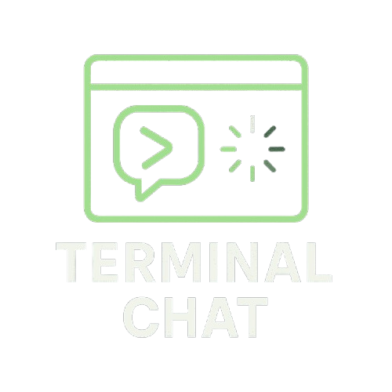

<p align="center"></p>

# Terminal Chat (tc)

[](https://github.com/ShaneMarusczak/terminal_chat/actions/workflows/rust.yml)

Terminal Chat (tc) is a Rust-based command-line chat assistant that integrates with OpenAI and Anthropic APIs to provide intelligent conversational capabilities. This project supports interactive REPL use as well as a CLI mode, with advanced features such as streaming, file context importing, document and README generation, theming, and command execution.

---

## Features

- **Interactive REPL:** A dynamic command-line chat interface with history and auto-completion.
- **API Integration:** Communicates with OpenAI’s and Anthropic’s endpoints for chat completions and image generations.
- **Command Suite:** Execute a variety of built-in commands including changing models, loading/saving conversations, generating README documentation, executing shell commands, and more.
- **Custom Configuration & Theming:** Easily customize settings such as the default chat model, streaming options, and message colors.
- **Markdown Preview:** Render and preview markdown responses directly in the terminal with ANSI styling.

---

## Installation

1. **Prerequisites:**
   - Install the latest stable version of [Rust](https://www.rust-lang.org/tools/install).
   - Ensure your system provides a proper terminal that supports ANSI escape codes.
   - Obtain API keys from your desired providers:
     - Set the `OPENAI_API_KEY` environment variable for OpenAI endpoints.
     - Set the `ANTHROPIC_API_KEY` environment variable for Anthropic endpoints.

2. **Clone the Repository:**

   ```sh
   git clone https://github.com/yourusername/tc.git
   cd tc
   ```

3. **Build the Project:**

   Run in release mode for optimized performance:

   ```sh
   cargo run --release
   ```

---

## Usage Guide

- **Chatting:**
  Simply type your message at the prompt (🗣️) and press Enter. The application will send your input to the chosen model and display the response in real-time.

- **Commands:**
  Commands are prefixed with a colon (`:`). Some common commands include:

  - `:help` – Display this help and available commands
  - `:clear` – Clears the current conversation context
  - `:cm` – Change the active Chat model
  - `:gf <file1> <file2> ...` – Add the contents of specified files to the conversation context
  - `:readme <directory> [extensions...]` – Generate a README.md document based on files in a directory
  - `:doc` – Document the current context into a Markdown report
  - `:q` or `:quit` – Quit the application

- **Tips:**

  - If a command is unrecognized, the tool will suggest a similar command based on minimum edit distance.
  - For commands that generate output files (such as readme and doc), follow the prompts to confirm the filename and save location.

---

## Configuration Details

TC Terminal Chat uses a JSON configuration file that is stored in your system’s configuration directory (or in the current directory as a fallback). Key configuration settings include:

- **enable_streaming:** Toggle streaming responses.
- **model:** The current chat model in use (e.g., "gpt-4o", "o3-mini").
- **all_models:** List of available models combining Anthropic and OpenAI models.
- **dev_message:** A custom developer instruction that influences chat behavior.
- **preview_md:** Whether to display responses rendered in ANSI-styled Markdown.
- **anthropic_enabled/openai_enabled:** Automatically enabled based on whether the API keys are set.
- **message_boxes_enabled:** Option to display messages in framed boxes, which disables streaming and markdown preview.
- **theme:** Allows configuration of message colors (system, user, assistant).
  Default colors are: system (yellow), user (green), assistant (blue).

You can update the configuration interactively with the `:ec` command in the REPL.

---

## Contribution Guidelines

Contributions are welcome! Please follow these steps:

1. Fork the repository and clone your fork.
2. Create a new branch for your feature or bugfix.
3. Ensure your code adheres to Rust coding best practices.
4. Submit a pull request with detailed information about your changes.

---

## License

This project is licensed under the terms specified in the [LICENSE](LICENSE) file.

---

Terminal Chat leverages multiple third-party libraries such as `tokio`, `serde`, `pulldown-cmark`, `crossterm`, and others. Please refer to the [Cargo.toml](Cargo.toml) for a complete list of dependencies.

Happy chatting!
